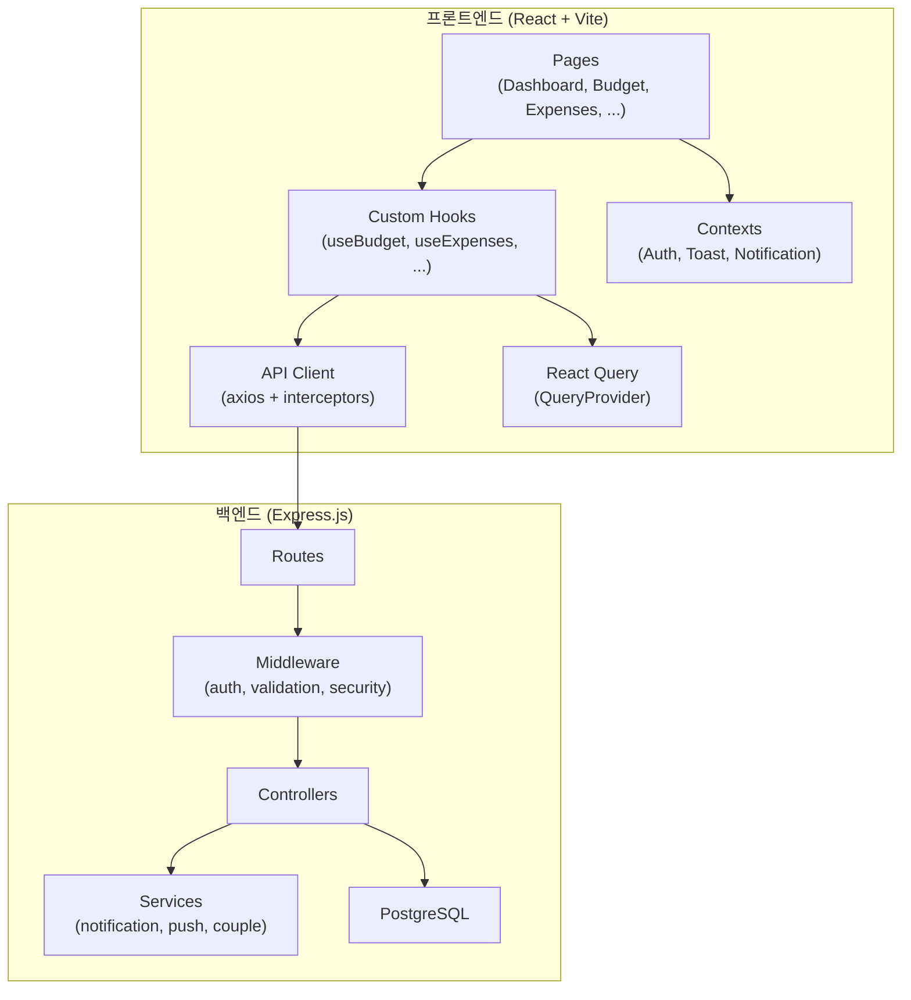
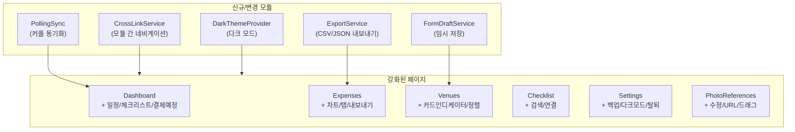

# 설계 문서: 베타 배포 준비 종합 리뷰

## 개요

이 설계 문서는 Wedding Planner 앱의 베타 배포 전 종합 리뷰에서 도출된 15개 요구사항의 기술적 구현 방안을 정의한다. 기존 React + TypeScript + Vite 프론트엔드와 Express.js + PostgreSQL 백엔드 아키텍처를 기반으로, 모듈 간 데이터 연결성 강화, UX 보완, 기능 확장을 목표로 한다.

핵심 설계 원칙:
- 기존 코드 패턴(React Query, custom hooks, API client, Toast 시스템) 최대한 활용
- 점진적 개선: 기존 컴포넌트를 확장하되 대규모 리팩토링 최소화
- 모바일 퍼스트: 모든 UI 변경은 모바일 환경 우선 고려
- 데이터 일관성: 모듈 간 연결 시 React Query `invalidateQueries` 패턴 활용

## 아키텍처

### 현재 아키텍처



### 변경 아키텍처 (추가 레이어)



## 컴포넌트 및 인터페이스

### 1. 모듈 간 연결 서비스 (요구사항 1, 2, 3)

#### CrossLinkNavigator 유틸리티

```typescript
// src/utils/crossLink.ts
interface CrossLinkParams {
  target: string;           // 대상 라우트
  filter?: Record<string, string>;  // 필터 파라미터
  highlight?: string;       // 하이라이트할 항목 ID
  action?: 'add' | 'view';  // 수행할 액션
}

// 사용 예: navigateCrossLink({ target: '/expenses', filter: { category: '예식장' } })
```

기존 `useNavigate` + `useSearchParams` 패턴을 활용하여 모듈 간 이동 시 필터/컨텍스트를 전달한다.

#### 예산-지출 연결 (요구사항 1)

- `Budget.tsx`: 카테고리 클릭 시 `navigate('/expenses?category_id=${id}')` 호출
- `Expenses.tsx`: URL 파라미터에서 `category_id` 읽어 자동 필터 적용
- `Expenses.tsx`: 필터링된 카테고리의 예산 대비 진행률 바 컴포넌트 추가
- `Dashboard.tsx`: 카테고리 바 클릭 시 지출 내역으로 이동, 초과 알림에 딥링크 추가

```typescript
// src/components/expense/CategoryBudgetProgress.tsx
interface CategoryBudgetProgressProps {
  categoryId: string;
  categoryName: string;
  budgetAmount: number;
  spentAmount: number;
}
```

#### 예식장-지출-일정 연결 (요구사항 2)

- 계약 확정 시 `ConfirmDialog`로 지출 자동 등록 제안
- 방문 예정 식장에 일정 추가 제안 다이얼로그
- `SelectedVenueDetail.tsx`에 관련 지출/일정 섹션 추가

```typescript
// src/components/venue/VenueExpenseSync.tsx
interface VenueExpenseSyncProps {
  venueId: string;
  contractData: VenueContract;
  onExpenseCreated: () => void;
  onEventCreated: () => void;
}
```

#### 체크리스트-일정-지출 연결 (요구사항 3)

- 체크리스트 완료 시 "관련 지출 등록" / "관련 일정 추가" 바로가기 표시
- 각 항목에 연관 일정/지출 요약 뱃지 추가

```typescript
// src/components/checklist/ChecklistActionLinks.tsx
interface ChecklistActionLinksProps {
  itemId: string;
  itemTitle: string;
  onAddExpense: () => void;
  onAddEvent: () => void;
}
```

### 2. 대시보드 강화 (요구사항 4)

기존 `Dashboard.tsx`의 `RecentActivityGrid`를 확장하여:

```typescript
// 추가 데이터 로드 (기존 useEffect 확장)
interface DashboardEnhancedData {
  upcomingEvents: CalendarEvent[];      // 최대 3개
  plannedExpenses: Expense[];           // status=planned, 결제 예정
  urgentChecklist: ChecklistItem[];     // 마감 임박 항목
  venueConfirmed: boolean;              // 예식장 확정 여부
  partnerActivity: ActivityItem[];      // 파트너 최근 활동
}
```

- KPI 카드 클릭 시 해당 페이지로 이동 (`onClick` 핸들러 추가)
- 예식장 확정 여부 위젯 추가

### 3. 지출 관리 강화 (요구사항 5)

#### 월별 차트 컴포넌트

```typescript
// src/components/expense/MonthlyExpenseChart.tsx
// 경량 차트: recharts 또는 순수 SVG 바 차트
interface MonthlyExpenseChartProps {
  expenses: Expense[];
  months?: number;  // 표시할 개월 수 (기본 6)
}
```

#### 상태별 탭 분리

```typescript
// Expenses.tsx 내 탭 추가
type ExpenseTab = 'all' | 'completed' | 'planned';
// 기존 filteredExpenses에 status 필터 추가
```

#### CSV 내보내기

```typescript
// src/utils/exportData.ts
export function exportToCSV(expenses: Expense[], filename?: string): void;
export function exportToJSON(data: any, filename?: string): void;
```

#### 결제 상태 변경

- "결제 예정" → "결제 완료" 변경 시 `ConfirmDialog`로 결제일 자동 설정 확인

### 4. 예식장 UX 보완 (요구사항 6)

- `VenueCardDeck.tsx`: 카드 인디케이터 (2/5) 추가
- `VenueCompare.tsx`: 최저가/최고가 하이라이트 로직 추가
- 제외 사유 필드: venues 테이블에 `exclusion_reason` 컬럼 추가
- 방문일 기준 정렬 옵션 추가
- 계약 폼 임시 저장: `localStorage` 기반 `useFormDraft` 훅

```typescript
// src/hooks/useFormDraft.ts
function useFormDraft<T>(key: string, initialData: T): {
  draft: T;
  setDraft: (data: T) => void;
  clearDraft: () => void;
  hasDraft: boolean;
}
```

### 5. 설정 및 프로필 (요구사항 7)

#### 결혼 예정일 변경 전파

```typescript
// Settings.tsx의 saveProfile 후 이벤트 발생
window.dispatchEvent(new CustomEvent('wedding-date-changed'));
// Dashboard, Checklist, Notification 컴포넌트에서 이벤트 리스닝
```

#### 데이터 백업/복원

```typescript
// 백엔드 API
// GET /api/backup/export - 전체 데이터 JSON 내보내기
// POST /api/backup/import - JSON 데이터 가져오기

// src/api/backup.ts
export const backupAPI = {
  exportData: () => apiClient.get('/backup/export', { responseType: 'blob' }),
  importData: (data: FormData) => apiClient.post('/backup/import', data),
};
```

#### 계정 삭제 (2단계 확인)

```typescript
// 1단계: ConfirmDialog "정말 탈퇴하시겠습니까?"
// 2단계: 비밀번호 재입력 확인
// DELETE /api/auth/account
```

#### 다크 모드

```typescript
// src/contexts/ThemeContext.tsx
// CSS 변수 기반 테마 전환
// tailwind.config.js에 darkMode: 'class' 설정
// document.documentElement.classList.toggle('dark')
```

### 6. 네비게이션 개선 (요구사항 8)

#### Layout 적용 확대

`App.tsx`에서 Layout 미적용 라우트에 Layout 래핑 추가:

```typescript
// 변경 전
<Route path="/notifications" element={<ProtectedRoute><NotificationCenter /></ProtectedRoute>} />
// 변경 후
<Route path="/notifications" element={<ProtectedRoute><Layout><NotificationCenter /></Layout></ProtectedRoute>} />
```

대상: `/notifications`, `/notifications/settings`, `/couple/connect`, `/announcements`, `/settings/password`

#### FAB 메뉴 확장

`Layout.tsx`의 FAB 메뉴에 "체크리스트 추가" 옵션 추가

#### 페이지 전환 애니메이션

```typescript
// src/components/common/PageTransition.tsx
// framer-motion의 AnimatePresence + motion.div 래퍼
```

### 7. 알림 시스템 강화 (요구사항 9)

#### 백엔드 알림 트리거 확장

```typescript
// backend/src/services/notificationTriggers.ts
// 체크리스트 마감 시기 도래 알림
// 결제 예정 지출 알림
// 커플 파트너 활동 알림

// 기존 notificationService.ts 확장
// CRON 또는 서버 시작 시 스케줄러로 주기적 체크
```

#### 딥링크 지원

```typescript
// 알림 data 필드에 link 정보 포함
// NotificationCenter에서 클릭 시 navigate(notification.link)
// 예: { link: '/expenses?id=123', type: 'expense_due' }
```

#### 실패 재시도

```typescript
// backend/src/services/notificationRetry.ts
// notifications 테이블에 retry_count, last_retry_at 컬럼 추가
// 실패 시 로그 기록 + 다음 주기에 재시도 (최대 3회)
```

### 8. 모바일 UX (요구사항 10)

#### 키보드 자동 스크롤

```typescript
// src/hooks/useKeyboardAvoid.ts
// visualViewport API 활용
// 모달 내 input focus 시 스크롤 위치 자동 조정
```

#### 무한 스크롤 / 페이지네이션

```typescript
// src/hooks/useInfiniteScroll.ts
// IntersectionObserver 기반
// 기존 expenses, checklist, events API의 page/limit 파라미터 활용
```

#### ConfirmDialog 통일

기존 `window.confirm()` 호출을 모두 `ConfirmDialog` 컴포넌트로 교체:
- `Budget.tsx`: 카테고리 삭제
- `Expenses.tsx`: 지출 삭제
- `Checklist.tsx`: 항목 삭제
- `PhotoReferences.tsx`: 사진 삭제

#### 커스텀 DatePicker 통일

`Schedule` 페이지의 `EventModal`에서 네이티브 `input[type=date]`를 커스텀 `DatePicker` 컴포넌트로 교체

### 9. 포토 레퍼런스 확장 (요구사항 11)

#### 사진 수정 기능

```typescript
// src/components/photo/PhotoEditModal.tsx
// 기존 상세 모달에 수정 버튼 추가
// PUT /api/photo-references/:id API 활용
```

#### URL 이미지 추가

```typescript
// 업로드 모달에 "URL로 추가" 탭 추가
// URL 입력 → 미리보기 → 저장
```

#### 드래그 앤 드롭 순서 변경

```typescript
// @dnd-kit/core 또는 react-beautiful-dnd 활용
// PATCH /api/photo-references/reorder API 추가
// photo_references 테이블에 sort_order 컬럼 추가
```

#### 카테고리별 개수 표시

```typescript
// 필터 버튼 옆에 뱃지: "야외 (5)"
// photos 배열에서 category별 count 계산
```

#### 좌우 스와이프 탐색

```typescript
// 상세 모달에서 터치 스와이프 또는 좌우 화살표로 이전/다음 사진 이동
// framer-motion의 drag 제스처 활용
```

### 10. 데이터 유효성 및 에러 처리 (요구사항 12)

#### 인라인 에러 메시지

```typescript
// src/hooks/useFormValidation.ts
interface ValidationRule {
  required?: boolean;
  minLength?: number;
  min?: number;
  pattern?: RegExp;
  message: string;
}

// 각 폼 컴포넌트에서 필드별 에러 상태 관리
// alert() 대신 필드 하단 빨간 텍스트 표시
```

#### API 에러 메시지 개선

기존 `src/api/client.ts`의 `getErrorMessage` 함수는 이미 상태 코드별 메시지를 제공하고 있으므로, 각 페이지에서 catch 블록의 에러 메시지를 `toast.error(error.response?.data?.message || '기본 메시지')` 패턴으로 통일

#### 토큰 자동 갱신

```typescript
// src/api/client.ts 인터셉터 확장
// 401 응답 시 refresh token으로 자동 갱신
// 갱신 실패 시 로그인 페이지 리다이렉트 + 안내 메시지
```

#### 금액 음수 방지

```typescript
// ExpenseForm, BudgetSettingModal 등의 금액 입력 필드에
// min={0}, onInput 핸들러로 음수 입력 차단
```

### 11. 커플 동기화 (요구사항 13)

#### 폴링 기반 동기화

```typescript
// src/hooks/useCoupleSync.ts
// 30초 간격 폴링으로 파트너 변경 감지
// GET /api/couple/last-activity API 추가
// 변경 감지 시 React Query invalidateQueries 호출
```

#### 커플 연결 상태 표시

```typescript
// Settings.tsx 계정 탭에 커플 연결 상태 뱃지 추가
// "연결됨: 파트너이름" 또는 "미연결"
```

#### 연결 해제 시 데이터 보존

```typescript
// 기존 coupleAPI.leaveCouple() 호출 전
// ConfirmDialog로 데이터 보존 여부 확인
// 백엔드에서 couple_id null 처리 시 데이터 유지 옵션
```

### 12. 검색 및 필터 (요구사항 14)

#### 체크리스트 검색

```typescript
// Checklist.tsx에 검색 입력 필드 추가
// 클라이언트 사이드 필터링 (items.filter by title)
// 완료/미완료 토글 UI 추가
```

#### 일정 검색

```typescript
// Schedule.tsx에 검색 입력 필드 추가
// 이벤트 제목/카테고리 기준 필터링
```

#### 검색어 초기화 버튼

```typescript
// 모든 검색 필드에 X 버튼 추가
// searchQuery가 비어있지 않을 때만 표시
```

### 13. 온보딩 (요구사항 15)

#### 초기 설정 화면 강화

```typescript
// 기존 SetupWizard 컴포넌트 확장
// 결혼 예정일 + 커플 이름 입력 단계 추가
// 완료 시 coupleAPI.updateProfile 호출
```

#### 예산 미설정 안내 배너

```typescript
// Budget.tsx에 totalBudget === 0일 때 안내 배너 표시
// "총 예산을 설정하면 카테고리별 예산 관리가 가능합니다"
```

#### 기능 페이지 사용 팁

```typescript
// 기존 FeatureHints 컴포넌트 활용
// 각 페이지 첫 방문 시 localStorage 기반 팁 표시
// "이 페이지에서는 ~할 수 있습니다" 형태의 간단한 안내
```

## 데이터 모델

### 데이터베이스 변경 사항

#### 신규 마이그레이션: 016_beta_readiness_updates.sql

```sql
-- 1. venues 테이블에 제외 사유 컬럼 추가
ALTER TABLE venues ADD COLUMN IF NOT EXISTS exclusion_reason TEXT;

-- 2. photo_references 테이블에 정렬 순서 컬럼 추가
ALTER TABLE photo_references ADD COLUMN IF NOT EXISTS sort_order INTEGER DEFAULT 0;

-- 3. notifications 테이블에 재시도 관련 컬럼 추가
ALTER TABLE notifications ADD COLUMN IF NOT EXISTS retry_count INTEGER DEFAULT 0;
ALTER TABLE notifications ADD COLUMN IF NOT EXISTS last_retry_at TIMESTAMP;
ALTER TABLE notifications ADD COLUMN IF NOT EXISTS delivery_status VARCHAR(20) DEFAULT 'sent';

-- 4. expenses 테이블에 연관 체크리스트 항목 ID 추가
ALTER TABLE expenses ADD COLUMN IF NOT EXISTS checklist_item_id INTEGER REFERENCES checklist_items(id) ON DELETE SET NULL;

-- 5. events 테이블에 연관 체크리스트 항목 ID 추가
ALTER TABLE events ADD COLUMN IF NOT EXISTS checklist_item_id INTEGER REFERENCES checklist_items(id) ON DELETE SET NULL;

-- 6. events 테이블에 연관 식장 ID 추가
ALTER TABLE events ADD COLUMN IF NOT EXISTS venue_id INTEGER REFERENCES venues(id) ON DELETE SET NULL;

-- 7. 인덱스 추가
CREATE INDEX IF NOT EXISTS idx_expenses_checklist_item ON expenses(checklist_item_id);
CREATE INDEX IF NOT EXISTS idx_events_checklist_item ON events(checklist_item_id);
CREATE INDEX IF NOT EXISTS idx_events_venue ON events(venue_id);
CREATE INDEX IF NOT EXISTS idx_photo_references_sort ON photo_references(couple_id, sort_order);
CREATE INDEX IF NOT EXISTS idx_notifications_retry ON notifications(delivery_status, retry_count);
```

### 신규 API 엔드포인트

| 메서드 | 경로 | 설명 |
|--------|------|------|
| GET | `/api/backup/export` | 전체 데이터 JSON 내보내기 |
| POST | `/api/backup/import` | JSON 데이터 가져오기 |
| DELETE | `/api/auth/account` | 계정 삭제 (회원 탈퇴) |
| GET | `/api/couple/last-activity` | 파트너 최근 활동 조회 |
| PATCH | `/api/photo-references/reorder` | 사진 순서 변경 |
| PUT | `/api/photo-references/:id` | 사진 정보 수정 |
| GET | `/api/expenses/monthly-summary` | 월별 지출 요약 |
| GET | `/api/expenses/export` | 지출 CSV 내보내기 |

### 프론트엔드 신규 파일

| 파일 | 설명 |
|------|------|
| `src/utils/crossLink.ts` | 모듈 간 네비게이션 유틸리티 |
| `src/utils/exportData.ts` | CSV/JSON 내보내기 유틸리티 |
| `src/hooks/useFormDraft.ts` | 폼 임시 저장 훅 |
| `src/hooks/useFormValidation.ts` | 폼 유효성 검사 훅 |
| `src/hooks/useKeyboardAvoid.ts` | 모바일 키보드 회피 훅 |
| `src/hooks/useInfiniteScroll.ts` | 무한 스크롤 훅 |
| `src/hooks/useCoupleSync.ts` | 커플 동기화 훅 |
| `src/contexts/ThemeContext.tsx` | 다크 모드 컨텍스트 |
| `src/components/expense/CategoryBudgetProgress.tsx` | 카테고리 예산 진행률 |
| `src/components/expense/MonthlyExpenseChart.tsx` | 월별 지출 차트 |
| `src/components/photo/PhotoEditModal.tsx` | 사진 수정 모달 |
| `src/components/common/PageTransition.tsx` | 페이지 전환 애니메이션 |
| `src/api/backup.ts` | 백업 API 클라이언트 |
| `backend/src/controllers/backupController.ts` | 백업 컨트롤러 |
| `backend/src/routes/backup.ts` | 백업 라우트 |
| `backend/src/config/migrations/016_beta_readiness_updates.sql` | DB 마이그레이션 |


## 정확성 속성 (Correctness Properties)

*속성(Property)은 시스템의 모든 유효한 실행에서 참이어야 하는 특성 또는 동작입니다. 속성은 사람이 읽을 수 있는 명세와 기계가 검증할 수 있는 정확성 보장 사이의 다리 역할을 합니다.*

### Property 1: 카테고리 필터링 정확성

*For any* 예산 카테고리 ID와 지출 목록에 대해, 해당 카테고리 ID로 필터링된 지출 목록은 오직 해당 카테고리에 속하는 지출만 포함해야 한다.

**Validates: Requirements 1.1, 1.4**

### Property 2: 예산-지출 합계 일관성

*For any* 예산 카테고리에 대해, 해당 카테고리의 표시된 지출 합계(spentAmount)는 해당 카테고리에 속하는 모든 지출의 amount 합과 동일해야 한다.

**Validates: Requirements 1.2**

### Property 3: 예산 초과 감지 정확성

*For any* 예산 카테고리 집합에 대해, spentAmount > budgetAmount이고 budgetAmount > 0인 카테고리만 초과 카테고리로 표시되어야 한다.

**Validates: Requirements 1.5**

### Property 4: 예식장 계약 비용 일관성

*For any* 계약 완료된 예식장에 대해, 표시되는 총 비용은 해당 식장과 연관된 지출 항목들의 합계와 일치해야 한다.

**Validates: Requirements 2.3**

### Property 5: 체크리스트 연관 데이터 집계 정확성

*For any* 체크리스트 항목에 대해, 표시되는 연관 일정 개수는 해당 항목의 checklist_item_id를 참조하는 events 수와 일치하고, 연관 지출 금액은 해당 항목을 참조하는 expenses의 amount 합과 일치해야 한다.

**Validates: Requirements 3.2**

### Property 6: 대시보드 다가오는 일정 제한

*For any* 일정 목록에 대해, 대시보드에 표시되는 다가오는 일정은 최대 3개이며, 날짜 오름차순으로 정렬되어야 한다.

**Validates: Requirements 4.1**

### Property 7: 대시보드 결제 예정 필터링

*For any* 지출 목록에 대해, 대시보드의 결제 예정 섹션에는 status가 'planned'인 지출만 표시되어야 한다.

**Validates: Requirements 4.2**

### Property 8: 대시보드 마감 임박 체크리스트 정확성

*For any* 체크리스트 항목 집합에 대해, 대시보드에 표시되는 마감 임박 항목은 is_completed가 false이고 due_period가 현재 D-day에 가장 가까운 항목이어야 한다.

**Validates: Requirements 4.3**

### Property 9: 월별 지출 집계 정확성

*For any* 지출 목록에 대해, 월별 차트에 표시되는 각 월의 합계는 해당 월에 속하는 지출의 amount 합과 동일해야 한다.

**Validates: Requirements 5.1**

### Property 10: 지출 상태별 탭 필터링

*For any* 지출 목록에 대해, 'completed' 탭에는 status='completed'인 지출만, 'planned' 탭에는 status='planned'인 지출만 표시되어야 한다.

**Validates: Requirements 5.2**

### Property 11: 결제 예정 알림 트리거

*For any* status='planned'이고 due_date가 현재 날짜로부터 3일 이내인 지출에 대해, 해당 지출에 대한 결제 예정 알림이 생성되어야 한다.

**Validates: Requirements 5.3, 9.2**

### Property 12: 지출 CSV 내보내기 라운드 트립

*For any* 지출 목록에 대해, CSV로 내보낸 후 파싱하면 원본 지출 데이터(제목, 금액, 날짜, 카테고리)와 동일한 데이터를 복원할 수 있어야 한다.

**Validates: Requirements 5.4**

### Property 13: 식장 카드 인디케이터 정확성

*For any* N개의 식장 목록에서 현재 i번째 카드를 보고 있을 때, 인디케이터는 "i/N" 형식으로 표시되어야 하며, 1 ≤ i ≤ N이어야 한다.

**Validates: Requirements 6.1**

### Property 14: 식장 비교 최저가/최고가 정확성

*For any* 비교 대상 식장 집합과 비교 항목에 대해, 하이라이트된 최저가는 해당 항목의 실제 최솟값이고, 최고가는 실제 최댓값이어야 한다.

**Validates: Requirements 6.2**

### Property 15: 방문일 기준 정렬 정확성

*For any* 식장 목록에 대해, 방문일 기준 정렬 시 목록은 방문일 오름차순(또는 내림차순)으로 정렬되어야 한다.

**Validates: Requirements 6.4**

### Property 16: 폼 임시 저장 라운드 트립

*For any* 폼 데이터에 대해, localStorage에 저장한 후 복원하면 원본 데이터와 동일한 값을 얻어야 한다.

**Validates: Requirements 6.5, 12.5**

### Property 17: 결혼 예정일 변경 전파

*For any* 결혼 예정일 변경에 대해, 변경 후 Dashboard의 D-day 계산, Checklist의 시기 계산이 새로운 날짜를 기준으로 갱신되어야 한다.

**Validates: Requirements 7.1**

### Property 18: 데이터 백업/복원 라운드 트립

*For any* 사용자 데이터(예산, 지출, 체크리스트, 일정)에 대해, JSON으로 내보낸 후 가져오기하면 원본 데이터와 동일한 데이터를 복원할 수 있어야 한다.

**Validates: Requirements 7.2, 7.3**

### Property 19: 다크 모드 토글

*For any* 다크 모드 설정 상태에 대해, 다크 모드를 활성화하면 document root에 'dark' 클래스가 추가되고, 비활성화하면 제거되어야 한다.

**Validates: Requirements 7.5**

### Property 20: 체크리스트 마감 알림 트리거

*For any* 미완료 체크리스트 항목에 대해, 해당 항목의 due_period가 현재 D-day와 일치하면 완료 독촉 알림이 생성되어야 한다.

**Validates: Requirements 9.1**

### Property 21: 커플 파트너 활동 알림

*For any* 커플 파트너의 데이터 변경(지출 등록, 체크리스트 완료)에 대해, 상대방에게 활동 알림이 생성되어야 한다.

**Validates: Requirements 9.3**

### Property 22: 알림 딥링크 정확성

*For any* link 필드가 있는 알림에 대해, 알림 클릭 시 해당 link 경로로 네비게이션이 수행되어야 한다.

**Validates: Requirements 9.4**

### Property 23: 알림 실패 재시도

*For any* 발송 실패한 알림에 대해, retry_count가 증가하고 delivery_status가 'failed'로 설정되며, 다음 주기에 재시도되어야 한다. 최대 재시도 횟수(3회) 초과 시 재시도를 중단해야 한다.

**Validates: Requirements 9.5**

### Property 24: 페이지네이션 데이터 제한

*For any* 목록 API 호출에 대해, 반환되는 항목 수는 요청한 limit 이하여야 하며, page와 limit에 따른 올바른 offset이 적용되어야 한다.

**Validates: Requirements 10.2**

### Property 25: 사진 수정 라운드 트립

*For any* 포토 레퍼런스에 대해, 제목/메모/카테고리/태그를 수정한 후 다시 조회하면 수정된 값이 반영되어야 한다.

**Validates: Requirements 11.1**

### Property 26: 사진 순서 변경 보존

*For any* 포토 레퍼런스 목록에 대해, 순서를 변경한 후 다시 조회하면 변경된 순서가 유지되어야 한다.

**Validates: Requirements 11.3**

### Property 27: 카테고리별 사진 개수 정확성

*For any* 포토 레퍼런스 집합에 대해, 각 카테고리 옆에 표시되는 개수는 해당 카테고리에 속하는 사진의 실제 개수와 일치해야 한다.

**Validates: Requirements 11.4**

### Property 28: 사진 갤러리 네비게이션

*For any* N개의 사진 목록에서 i번째 사진을 보고 있을 때, 다음 사진으로 이동하면 (i+1)번째 사진이 표시되고, 이전 사진으로 이동하면 (i-1)번째 사진이 표시되어야 한다. 경계값(첫 번째, 마지막)에서는 순환하거나 이동이 차단되어야 한다.

**Validates: Requirements 11.5**

### Property 29: 필수 필드 유효성 검사

*For any* 필수 필드가 있는 폼에 대해, 필수 필드가 비어있는 상태로 제출하면 해당 필드에 인라인 에러 메시지가 표시되고 제출이 차단되어야 한다.

**Validates: Requirements 12.1, 12.4**

### Property 30: API 에러 메시지 매핑

*For any* HTTP 에러 상태 코드(400, 401, 403, 404, 500 등)에 대해, 사용자에게 표시되는 에러 메시지는 해당 상태 코드에 맞는 한국어 메시지여야 한다.

**Validates: Requirements 12.2**

### Property 31: 토큰 갱신 흐름

*For any* 401 응답에 대해, refresh token이 유효하면 자동으로 토큰이 갱신되고 원래 요청이 재시도되어야 하며, refresh token도 만료되었으면 로그인 페이지로 리다이렉트되어야 한다.

**Validates: Requirements 12.3**

### Property 32: 커플 데이터 동기화

*For any* 커플 파트너의 데이터 변경에 대해, 폴링 주기 내에 상대방의 화면에 변경 사항이 반영되어야 한다.

**Validates: Requirements 13.1**

### Property 33: 검색 필터링 정확성

*For any* 검색 쿼리와 항목 목록(체크리스트 또는 일정)에 대해, 검색 결과는 제목에 검색 쿼리를 포함하는 항목만 반환해야 한다.

**Validates: Requirements 14.1, 14.2**

### Property 34: 검색어 초기화

*For any* 비어있지 않은 검색 쿼리에 대해, 초기화(X) 버튼이 표시되어야 하고, 클릭 시 검색 쿼리가 빈 문자열로 초기화되어야 한다.

**Validates: Requirements 14.3**

### Property 35: 완료/미완료 필터 토글

*For any* 체크리스트 항목 집합에 대해, 미완료 필터 활성화 시 is_completed가 false인 항목만 표시되어야 한다.

**Validates: Requirements 14.4**

### Property 36: 예산 미설정 안내 배너

*For any* 예산 설정에 대해, totalBudget이 0이면 안내 배너가 표시되고, 0보다 크면 배너가 표시되지 않아야 한다.

**Validates: Requirements 15.2**

### Property 37: 기능 팁 첫 방문 표시

*For any* 주요 기능 페이지에 대해, 해당 페이지를 처음 방문하면 사용 팁이 표시되고, 이후 방문에서는 표시되지 않아야 한다.

**Validates: Requirements 15.4**

## 에러 처리

### 프론트엔드 에러 처리 전략

| 에러 유형 | 처리 방식 | 사용자 피드백 |
|-----------|-----------|---------------|
| 네트워크 오류 | 로컬 캐시 유지 + 재시도 버튼 | Toast: "네트워크 연결을 확인해주세요" |
| 401 인증 만료 | 토큰 자동 갱신 → 실패 시 로그인 리다이렉트 | Toast: "세션이 만료되었습니다" |
| 400 입력 오류 | 인라인 에러 메시지 표시 | 필드 하단 빨간 텍스트 |
| 500 서버 오류 | ErrorBoundary 캐치 + Sentry 보고 | Toast: "서버 오류가 발생했습니다" |
| 폼 제출 실패 | 데이터 유지 + 재시도 옵션 | Toast + 재시도 버튼 |
| 오프라인 | localStorage 임시 저장 | 오프라인 배너 표시 |

### 백엔드 에러 처리 전략

| 에러 유형 | 처리 방식 |
|-----------|-----------|
| DB 연결 실패 | 재시도 로직 + 에러 로깅 |
| 데이터 무결성 위반 | 트랜잭션 롤백 + 구체적 에러 메시지 |
| 알림 발송 실패 | retry_count 증가 + 다음 주기 재시도 |
| 파일 업로드 실패 | 임시 파일 정리 + 에러 응답 |
| 백업 내보내기 실패 | 부분 데이터 방지 (트랜잭션) |

## 테스팅 전략

### 이중 테스팅 접근법

이 프로젝트는 단위 테스트와 속성 기반 테스트를 병행하여 포괄적인 커버리지를 확보한다.

### 단위 테스트 (Unit Tests)

- 프레임워크: Vitest (프론트엔드), Jest (백엔드)
- 대상: 특정 예시, 엣지 케이스, 에러 조건
- 범위:
  - 유틸리티 함수 (formatMoney, exportToCSV, crossLink)
  - API 클라이언트 에러 핸들링
  - 폼 유효성 검사 로직
  - 날짜 계산 함수 (D-day, 마감 시기)
  - 데이터 변환 함수 (API → UI 모델)

### 속성 기반 테스트 (Property-Based Tests)

- 프레임워크: fast-check (프론트엔드 + 백엔드 모두 지원)
- 설정: 각 테스트 최소 100회 반복
- 태그 형식: `Feature: beta-readiness-review, Property {number}: {property_text}`
- 각 정확성 속성은 하나의 속성 기반 테스트로 구현
- 대상:
  - 데이터 필터링/정렬 정확성 (Property 1, 6, 7, 8, 10, 15, 33, 35)
  - 데이터 집계 정확성 (Property 2, 5, 9, 27)
  - 라운드 트립 속성 (Property 12, 16, 18, 25)
  - 알림 트리거 로직 (Property 11, 20, 21, 23)
  - UI 상태 관리 (Property 3, 13, 14, 19, 28, 29, 34, 36, 37)
  - 동기화 로직 (Property 17, 31, 32)

### 테스트 우선순위

1. 높음: 데이터 일관성 (Property 2, 4, 5), 라운드 트립 (Property 12, 16, 18), 인증 (Property 31)
2. 중간: 필터링/정렬 (Property 1, 6, 7, 10, 33), 알림 (Property 11, 20, 23)
3. 낮음: UI 상태 (Property 13, 19, 34, 36, 37)
