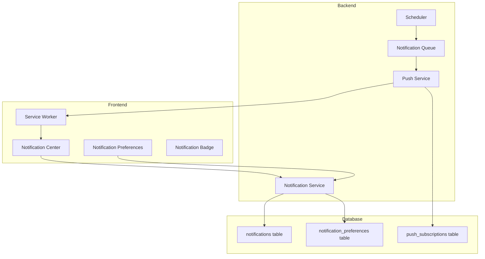

# Design Document: Notification System

## Overview

웨딩 예산 관리 앱의 알림 시스템은 사용자에게 중요한 정보를 적시에 전달하는 역할을 합니다. PWA 웹 푸시 알림과 인앱 알림 센터를 통해 D-day 알림, 일정 리마인더, 체크리스트 마감 알림, 예산 경고, 커플 활동 알림을 제공합니다.

## Architecture



## Components and Interfaces

### Backend Components

#### 1. Notification Service (`notificationService.ts`)
- 알림 생성, 조회, 업데이트, 삭제
- 알림 타입별 처리 로직
- 사용자 선호도 확인

#### 2. Push Service (`pushService.ts`)
- Web Push API 연동
- VAPID 키 관리
- 푸시 구독 관리

#### 3. Notification Scheduler (`notificationScheduler.ts`)
- D-day 마일스톤 체크
- 일정 리마인더 스케줄링
- 체크리스트 마감 체크
- 예산 임계값 모니터링

### Frontend Components

#### 1. NotificationCenter (`NotificationCenter.tsx`)
- 알림 목록 표시
- 읽음/안읽음 상태 관리
- 알림 클릭 시 네비게이션

#### 2. NotificationBadge (`NotificationBadge.tsx`)
- 안읽은 알림 개수 표시
- 헤더/네비게이션에 통합

#### 3. NotificationPreferences (`NotificationPreferences.tsx`)
- 알림 카테고리별 토글
- 알림 시간 설정
- 푸시 권한 요청

### API Endpoints

```typescript
// 알림 관련
GET    /api/notifications              // 알림 목록 조회
GET    /api/notifications/unread-count // 안읽은 알림 개수
PUT    /api/notifications/:id/read     // 알림 읽음 처리
DELETE /api/notifications/:id          // 알림 삭제
DELETE /api/notifications              // 전체 알림 삭제

// 알림 설정
GET    /api/notifications/preferences  // 알림 설정 조회
PUT    /api/notifications/preferences  // 알림 설정 업데이트

// 푸시 구독
POST   /api/push/subscribe             // 푸시 구독 등록
DELETE /api/push/unsubscribe           // 푸시 구독 해제
```

## Data Models

### notifications 테이블
```sql
CREATE TABLE notifications (
    id UUID PRIMARY KEY DEFAULT gen_random_uuid(),
    user_id UUID NOT NULL REFERENCES users(id) ON DELETE CASCADE,
    type VARCHAR(50) NOT NULL,
    title VARCHAR(255) NOT NULL,
    message TEXT NOT NULL,
    data JSONB DEFAULT '{}',
    link VARCHAR(255),
    is_read BOOLEAN DEFAULT FALSE,
    created_at TIMESTAMP WITH TIME ZONE DEFAULT NOW(),
    read_at TIMESTAMP WITH TIME ZONE
);

CREATE INDEX idx_notifications_user_id ON notifications(user_id);
CREATE INDEX idx_notifications_created_at ON notifications(created_at DESC);
CREATE INDEX idx_notifications_is_read ON notifications(user_id, is_read);
```

### notification_preferences 테이블
```sql
CREATE TABLE notification_preferences (
    id UUID PRIMARY KEY DEFAULT gen_random_uuid(),
    user_id UUID NOT NULL UNIQUE REFERENCES users(id) ON DELETE CASCADE,
    dday_enabled BOOLEAN DEFAULT TRUE,
    dday_daily BOOLEAN DEFAULT FALSE,
    schedule_enabled BOOLEAN DEFAULT TRUE,
    checklist_enabled BOOLEAN DEFAULT TRUE,
    budget_enabled BOOLEAN DEFAULT TRUE,
    couple_enabled BOOLEAN DEFAULT TRUE,
    announcement_enabled BOOLEAN DEFAULT TRUE,
    preferred_time TIME DEFAULT '09:00:00',
    created_at TIMESTAMP WITH TIME ZONE DEFAULT NOW(),
    updated_at TIMESTAMP WITH TIME ZONE DEFAULT NOW()
);
```

### push_subscriptions 테이블
```sql
CREATE TABLE push_subscriptions (
    id UUID PRIMARY KEY DEFAULT gen_random_uuid(),
    user_id UUID NOT NULL REFERENCES users(id) ON DELETE CASCADE,
    endpoint TEXT NOT NULL,
    p256dh TEXT NOT NULL,
    auth TEXT NOT NULL,
    created_at TIMESTAMP WITH TIME ZONE DEFAULT NOW(),
    UNIQUE(user_id, endpoint)
);
```

### Notification Types
```typescript
type NotificationType = 
    | 'dday_milestone'      // D-100, D-30, D-7, D-1, D-Day
    | 'dday_daily'          // 매일 D-day 알림
    | 'schedule_reminder'   // 일정 리마인더
    | 'checklist_due'       // 체크리스트 마감 임박
    | 'checklist_overdue'   // 체크리스트 마감 초과
    | 'budget_warning'      // 예산 80% 도달
    | 'budget_exceeded'     // 예산 초과
    | 'couple_activity'     // 커플 활동
    | 'announcement';       // 관리자 공지

interface Notification {
    id: string;
    userId: string;
    type: NotificationType;
    title: string;
    message: string;
    data: Record<string, any>;
    link?: string;
    isRead: boolean;
    createdAt: Date;
    readAt?: Date;
}
```

## Correctness Properties

*A property is a characteristic or behavior that should hold true across all valid executions of a system-essentially, a formal statement about what the system should do. Properties serve as the bridge between human-readable specifications and machine-verifiable correctness guarantees.*

### Property 1: D-day Calculation Accuracy
*For any* wedding date and current date, the D-day calculation should equal the difference in days between the wedding date and current date.
**Validates: Requirements 1.1**

### Property 2: Milestone Notification Triggering
*For any* D-day value that matches a milestone (100, 30, 7, 1, 0), the system should generate exactly one milestone notification.
**Validates: Requirements 1.2**

### Property 3: Preference-Respecting Notifications
*For any* notification type and user preference setting, notifications should only be sent when the corresponding preference is enabled.
**Validates: Requirements 1.3, 5.2**

### Property 4: Budget Threshold Detection
*For any* budget and expense total, a warning notification should be generated if and only if expenses/budget > 0.8 and <= 1.0, and an exceeded notification if expenses/budget > 1.0.
**Validates: Requirements 4.1, 4.2**

### Property 5: Threshold Crossing Detection
*For any* expense addition that causes the total to cross a budget threshold (80% or 100%), exactly one notification should be generated for that crossing.
**Validates: Requirements 4.3**

### Property 6: Notification Sorting
*For any* list of notifications returned by the API, they should be sorted in descending order by creation date.
**Validates: Requirements 6.1**

### Property 7: Unread Count Accuracy
*For any* set of notifications for a user, the unread count should equal the number of notifications where isRead is false.
**Validates: Requirements 6.3**

### Property 8: Read Status Update
*For any* notification marked as read, the isRead field should be true and readAt should be set to a non-null timestamp.
**Validates: Requirements 6.2**

### Property 9: Couple Activity Notification
*For any* action (venue/expense/checklist change) by a coupled user, exactly one notification should be created for the partner.
**Validates: Requirements 7.1, 7.2, 7.3**

### Property 10: Announcement Broadcast
*For any* announcement created by an admin, notifications should be created for all active users.
**Validates: Requirements 8.1**

## Error Handling

### Push Notification Errors
- 구독 만료: 자동으로 구독 레코드 삭제
- 전송 실패: 3회 재시도 후 로깅
- 권한 거부: 인앱 알림으로 폴백

### Database Errors
- 연결 실패: 재시도 로직 적용
- 트랜잭션 실패: 롤백 및 에러 응답

### Validation Errors
- 잘못된 알림 타입: 400 Bad Request
- 존재하지 않는 알림: 404 Not Found
- 권한 없음: 403 Forbidden

## Testing Strategy

### Unit Testing
- 알림 생성 로직 테스트
- D-day 계산 테스트
- 예산 임계값 계산 테스트
- 알림 정렬 테스트

### Property-Based Testing
- **Library**: fast-check (TypeScript)
- **Minimum iterations**: 100

각 correctness property에 대해 property-based test를 작성합니다:
- 랜덤 날짜로 D-day 계산 검증
- 랜덤 예산/지출로 임계값 검증
- 랜덤 알림 목록으로 정렬 검증
- 랜덤 읽음 상태로 카운트 검증

### Integration Testing
- API 엔드포인트 테스트
- 푸시 알림 전송 테스트
- 데이터베이스 연동 테스트

### E2E Testing
- 알림 센터 UI 테스트
- 알림 설정 변경 테스트
- 푸시 권한 요청 플로우 테스트
